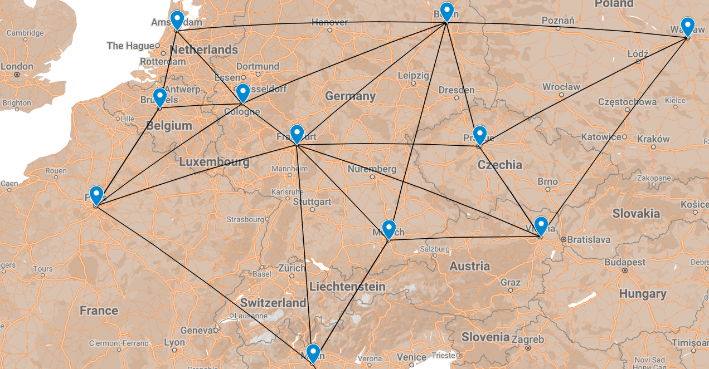

## Finding The Shortest Distance
This program was developed as an assignment for a **DATA STRUCTURES** and **ALGORITHMS** class. It is a Dijkstra's shortest-path application that takes in a list of cities, a list of distances between cities, and then starts an interactive application. The program will ask the user for two cities, and then return the shortest distance between those two cities. It will continue until they type exit.

### Guidelines
The client will provide a list of cities/vertices and a list of distances between cities as a command line argument.
- Usage: ./map.out <vertices> <distances>

After the information is loaded, the application will ask: Where do you want to go today?
They will have the following options for input:
-	list: list all cities
-	< city1 > < city2 >: finds the shortest path between two cities
-	help: print this help message
-	exit: exit the program
  
When two cities are entered the application will print the shortest path from city one to city two, and the total distance.
If there is no path, it will print "Path Not Found..."

Example input files provided in [inputs](/inputs).

### Assignment Questions 

1. What is the difference between a directed and undirected graph?

   A directed graph does not presume symmetry is the direction of its edges. Meaning, edge A can connect and lead to edge B, but B may not conect to A. Undirected graphs assumes reciprocity in the realationship between the vertices and their edges. Meaning that in a undirected graph A can connect to B, and B connect to A. It is not a one way relationship.

2. What is the Big O of Dijkstra's algorithm.... 

   * Assuming you used an array (or list) to store the vertices.
   The Big O of using an adjacency matrix for Dijkstra's algorithm is O(V^2), where V is the number of vertices in the graph. This is because each vertices in the matrix has to be visited, and then each neighbor has to be visited to find the shortest path. The Big O of implementing the algorithm with an adjacency list would be O((E + V)^2), where E is the number of edges and V the number of vertices. This is because without using a priority queue, a linear search would need to be conducted wich would take O(V) for each vertex making it V^2. Additionally, the cost of traversing to each vertex needs to be acounted for which would be O(E).

   * Assuming you used a heap / priority queue to store the vertices.
   When using a priority queue the Big O of Dijkstra's algorithm can be brought down to O((V + E)log V).
   This is because the priority queue is used to store the vertices that have not been visited yet, and they are ordered by their distance from the origin vertex. At each step the vertex with the smallest distance is selected from the priority queue and the neighboring vertices are added to the queue. The operations of the priority queue take O(logV) time and because as the edges are traveled each vertex is added to the queue and removed the total runtime simplifies to O((V + E)logV).

3. Explain in your own words what that means for larger graphs when trying to find the shortest distance.

   For much larger graphs it is more sensible to implement Dijkstra's algorithm using a priority queue as the difference in runtime between O(V^2) and O((V + E)logV) is particularly evident as the data size increases. For larger graphs the amount of traveling the algorithm has to do to compute the shortest paths will keep growing in time complexity unless a more efficient data structure is used. This is especially true depending on the type of graph, it is more dense (has more connectivity) or more sparse.

4. For this assignment, you didn't need the most "efficient" set of data structures (for example, a heap wasn't required). However, think on the scale of google/apple maps - they have to deal with millions of vertices and edges. What data structures would you use to store the graph? Why? Somethings to consider - would you be able to store the entire graph at a time? Could you break it up into smaller pieces? How would you do that? Would there be advantages to caching/memoization of paths? You are free to explore your thoughts on this subject/reflect on various ideas. Other than a realization of some scalability of problems, there isn't a wrong answer. 

   When dealing with millions of vertices and edges it would be important to choose the data structure that most optimizes query time and memory usage. Although arrays are very efficient in terms of retreival time, they are not necessarily good when needing to keep adding nodes or edges. If there is knowledge that the data size migh continue to grow it would be good to consider data structures such as lists that are more conducive for growth. Adding an element of hierarchy (such as using a priority queue) can help the search time of an algorithm go down. Looking to implement data structures with faster search times such as a binary tree could maybe help in terms of traversing from one point to another if there is a particular order in which vertices can be placed. Caching and memoization can also help increasing runtime so that previously computed paths don't need to be recursively calculated. Distributing or splitting a graph into smaller data can also help with runtime and memory, if the target data is able to be combed out from a larger set of data, then the search time could be split by only looking through a smaller section of data.

5. Related to shortest distance, is a problem called the "messenger" or "traveling sales (man/person)" problem commonly abbreviated to TSP. This problem is to find the shortest path that visits **every** vertex in a graph. Another way to look at it, is you are an delivery driver, and you have a series of packages to deliver. Can you find an optimal path for your deliveries that minimizes the total distance traveled? Imagine if you had 5 stops. How many different paths are there?  There are 120 possible paths to look at! (assuming fully connected routes). 

   * How many possible paths are there if you have 6 stops?
   With 6 stops the number of possible paths would be 720 (6!).

   * How many possible paths are there if you have 10 stops?
   With 10 stops the number of possible paths would be 3,628,800 (10!).

6. What type of growth is this problem? 
   The type of growth is a factorial which is a type of exponential function. As the number of possible vertices to visit grows, the number of possible paths grows exponentially at a rate higher than that of a polynomial of an exponential function with a fixed base.

7. Take some time to research TSP problems. It falls under a certain classification of problems? What is it? 
   TSP problems are categorized as NP hard problem. NP (nondeterministic polynomial) problems are a set of problems whose solutions can be verified in polynomial time, but no known algorithm can solve them in that time. Meaning that it can take algorithms exponential time to solve a problem that could tecnically be solved in polynomial time. 

8. Provide some examples of fields / problems that use TSP.
   Some fields / problems that use TSP include:
      - Delivery and supply chain management in solving the most efficient way to deliver goods to various locations
      - Planning routes for public transit systems
      - Network design, such as finding the shortest path for data packets to travel through a network
